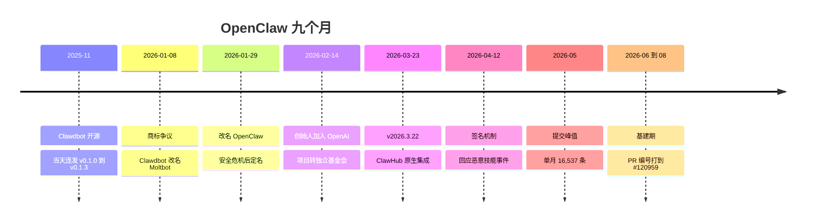
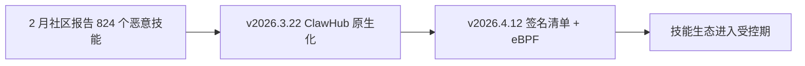

# 《OpenClaw 项目开发编年史,从爆火到易主的九个月》

> 整理日期 2026-08-09
> 数据来源 74,472 条主线提交聚合核对、344 个 tag、233 个 release、新闻与社区报道交叉验证
> 关联笔记 官方 release notes、ClawHub 技能市场、Moltbook 社区
> 核心结论 九个月从零冲到 GitHub 历史增长榜首,一个人贡献了一半提交;一次商标争议把项目推向对手,版本号从 v0.1.0 一路滚到 v2026.6.34

## §0 项目是什么

OpenClaw 是一个开源的个人 AI 助手框架,跑在用户自己的设备上(最常见的形态是一台 Mac Mini),通过 WhatsApp、Telegram、Discord、Signal、iMessage 这些日常聊天应用跟人说话。它能清收件箱、管日历、订机票、执行代码、浏览网页、操控电脑。2025 年 11 月 24 日开源,九个月里成为 GitHub 历史上增长最快的开源项目,社区统计超过 150 万个 agent 被创建。它的吉祥物是龙虾,口号是 The claw is the law。

| 指标 | 数值 |
|---|---|
| 生命周期 | 2025-11-24 到 2026-08-08(约 9 个月) |
| 主线提交数 | 74,472(first-parent 口径) |
| 作者数 | 3,127 |
| tag 数 | 344 |
| release 数 | 233 |
| star 数 | 约 38.5 万 |
| 主要语言 | 以 Go 与 TS 生态为主,多语言并存 |

月度提交量(主线)。

```
2025-11 ████ 288
2025-12 ████████████████████████ 2087
2026-01 ██████████████████████████████████████████████████ 5263
2026-02 ████████████████████████████████████████████████████████████ 6854
2026-03 ████████████████████████████████████████████████████████████████████████ 8050
2026-04 ████████████████████████████████████████████████████████████████████████████████████████ 14586
2026-05 ████████████████████████████████████████████████████████████████████████████████████████████████ 16537
2026-06 ████████████████████████████████████████████ 7036
2026-07 ██████████████████████████████████████████████████████████ 11465
2026-08 ████████████ 2306(截至 8 月 8 日)
```

项目全景 timeline。



## §1 人物图鉴

| 作者 | 主线提交数 | 占比 | 角色定位 |
|---|---|---|---|
| Peter Steinberger | 37,895 | 50.9% | 创始人,整个项目的发动机 |
| Vincent Koc | 11,704 | 15.7% | 第二大贡献者,社区到核心的桥梁 |
| Shakker | 4,054 | 5.4% | 常驻贡献者 |
| Ayaan Zaidi | 1,842 | 2.5% | 核心圈贡献者,前后两个邮箱 |
| Tak Hoffman | 832 | 1.1% | 基础设施方向 |
| Gustavo Madeira Santana | 780 | 1.0% | 跨生态贡献者 |
| github-actions 等机器人 | 1,242 | 1.7% | 自动化与发布流水线 |

其余 3,100 余位作者合计约 22%。这个项目把"众包"写到了极致,但主线的一半始终握在一个人手里。

## §2 2025-11 诞生(288 条)

一句话。一个奥地利开发者用一小时搭出的 WhatsApp 助手原型,开源当天连发四个版本,名字叫 Clawd,谐音 Claude。

`f6dd362d` Initial commit,2025-11-24,仓库开张。

`chore: release 1.2.1`、`chore: release 1.2.2`(11-25 当天)v0.1.0 到 v0.1.3 一天内连发,发布即高速迭代。

`Add auto-recovery from stuck WhatsApp sessions`、`Increase watchdog timeout to 30 minutes` WhatsApp 会话自愈与看门狗,消息通道的可靠性从第一天就是重点。

`feat: same-phone mode with echo detection and configurable marker` 同手机模式与回声检测,一个账号自己回自己的场景专门处理。

`docs: Add Twitter automation and music recognition examples` 文档里出现推特自动化和音乐识别示例,产品野心从诞生月就写在 README 里。

本章关键词。`WhatsApp` `一小时原型` `当天四连发` `看门狗`

## §3 2025-12 产品化(2,087 条)

一句话。从"能跑的脚本"变成"有版本、有媒体处理、有名字的产品",仓库从 steipete/clawdis 迁向 openclaw。

`fix(media): sniff mime and keep extensions`、`docs: document mime-first media handling` 媒体按 MIME 嗅探处理,图片语音不再是裸数据。

`Merge branch 'main' of https://github.com/steipete/clawdis` 12 月的合并消息里还能看到前身仓库 steipete/clawdis 的地址,历史迁移的痕迹。

`Rename claude-config.md to clawd.md, update credits` 配置文档改名,品牌从 Claude 谐音走向自己的名字。

v1.0.4 到 v1.3.0,12 月 2 日就推到 v1.3.0,版本节奏以天计。

本章关键词。`产品化` `媒体处理` `仓库迁移` `v1.3.0`

## §4 2026-01 改名风暴与版本制(5,263 条)

一句话。Clawdbot 被 Anthropic 商标争议点名,一周内改名三次,期间假代币骗局借势收割;版本号在同一个月切换成日期制,每天发布。

`#3677` 到 `#5807` 一月 PR 编号从 #3677 打到 #5807,合入流水线已经成形。

`Merge pull request #5723 from openclaw/ci/formal-conformance`、`#5807 ci/formal-conformance-alias-check` 形式一致性测试(conformance)进入 CI,大项目的第一批护栏。

`v2.0.0-beta1` 到 `beta5`(1 月 3 日)2.0 测试版在改名风暴前收尾。

`v2026.1.8`(1 月 8 日)版本制切换,从此 tag 按日期走,v2026.1.11 当天连发四个补丁号。

1 月 27 日,Anthropic 法务提出商标争议,认为 Clawd 与 Claude 发音过近;1 月 8 日起 Clawdbot 改名 Moltbot,1 月 29 日定名 OpenClaw。改名窗口里,冒充项目的假 $CLAWD 代币骗局一度冲到 1,600 万美元市值。

本章关键词。`改名风暴` `日期版本制` `conformance` `假代币骗局`

## §5 2026-02 易主(6,854 条)

一句话。创始人接住 Meta 与 OpenAI 两边的橄榄枝,2 月 14 日宣布加入 OpenAI 领导下一代个人代理,项目转为 OpenAI 赞助的独立开源基金会。

`Merge remote-tracking branch 'prhead/feat/slack-text-streaming'` Slack 文本流式接入,渠道矩阵再扩一块。

`#5807` 之后 PR 编号继续滚,社区贡献者的名字开始密集出现在合并消息里。

2 月 16 日前后,安全研究者统计出 ClawHub 上 824 个恶意技能,伪装成加密与效率工具窃取信息,供应链阴影第一次落到技能生态头上。

Steinberger 说"想改变世界,而不是开一家大公司"。同月晚些时候的报道显示,他带进 OpenAI 的团队用约 100 个并发 AI 编码代理开发 OpenClaw,每月烧掉约 130 万美元的 API 额度。

本章关键词。`OpenAI` `基金会` `Slack` `恶意技能`

## §6 2026-03 生态爆发(8,050 条)

一句话。v2026.3.22 一次发布 45 个新功能、13 个破坏性变更,ClawHub 从网站变成 CLI 内建命令。

`v2026.3.22`(3 月 23 日)45 个新功能,包括 48 小时默认 agent 超时、SSH 与 OpenShell 沙箱后端、一大批新 LLM 供应商,以及把 ClawHub 原生接进 `openclaw plugins install`。

`移除 .moltbot 目录与 CLAWDBOT_/MOLTBOT_ 环境变量` 旧品牌痕迹一次性清掉,迁移交给 `openclaw doctor --fix`。

`Merge branch 'main' of https://github.com/openclaw/openclaw` 三月的合并消息几乎只剩主线对主线,分支策略收敛。

MoltHub 技能市场同期达到 8,000 多个技能、20 万月活,后被官方 ClawHub 取代。

本章关键词。`v2026.3.22` `ClawHub` `沙箱` `破坏性变更`

## §7 2026-04 安全加固(14,586 条)

一句话。恶意技能事件后,4 月 12 日的版本给技能生态装上签名锁链,提交量冲到 14,586 的高位。

`v2026.4.12` 响应恶意技能,技能清单 clawmanifest.json 用 SHA256 钉死文件路径、网络端点与 shell 命令,内核级 eBPF 强制杀掉脚本外的进程。

`v2026.4.9` 到 `v2026.5.16-beta.7`,4 月 9 日到 5 月 18 日的版本序列,beta 后缀开始出现,发布节奏从日更进入周更加预发布。

`Merge branch 'main'` 海量合并提交是这一月的底色,基建与安全修复在峰值流量下并行推进。

本章关键词。`签名机制` `eBPF` `供应链安全` `14,586`

## §8 2026-05 巅峰(16,537 条)

一句话。单月 16,537 条主线提交,九个月的最高点,社区与团队同时全速运转。

`#8xxxx` 段 PR 编号出现,社区 PR 池已经深到五位数。

同月报道称,Steinberger 团队约 100 个并发 AI 编码代理、每月 130 万美元 API 消耗的细节公开,"龙虾之父烧钱"成了科技媒体的标题。

Moltbook 上,纯 AI agent 组成的社交网络(moltys)已经跑起来,社区 agent 案例 dancesWithClaws 的 "Logan" 每小时心跳发帖。

本章关键词。`16,537` `百代理并行` `Moltbook` `烧钱`

## §9 2026-06 到 08 基建期(7,036 + 11,465 + 2,306)

一句话。提交量回落但仍高位,PR 编号从 #87xxx 滚到 #120959,焦点从功能转向基础设施。

`Merge pull request #87273 from BSG2000/fix/talk-openai-realtime-auth-diagnostic-pr` 7 月,OpenAI 实时语音的认证诊断,社区成员直接修核心通道。

`Merge pull request #116684 from openclaw/fix/talk-relay-disconnect-cleanup` 通话中继断连清理。

`merge: bound Discord realtime exact speech retention` 8 月,Discord 实时语音保留上限。

`merge: land llama.cpp lifecycle fix` 本地推理引擎生命周期修复,本地优先的路线还在。

`#120959`(8 月 8 日)fix(infra): 启动迁移 lease 并发修复,最新的主线提交。

`v2026.6.34`(8 月 4 日)版本号滚到 6.34,九个月发布了 233 个 release。

本章关键词。`基建期` `#120959` `实时语音` `llama.cpp`

## §10 尾声(经验总结)

1. **一个人是发动机,社区是燃料**。50.9% 的主线提交来自创始人,但没有 3,100 多位贡献者,九个月到不了这个量级。
2. **品牌是命门**。Clawd 谐音 Claude 的取名在九个月后回头看,是爆火的起点,也是被商标争议点名、被迫一周三改的伏笔。
3. **生态要趁早锁死**。ClawHub 原生集成、签名清单、eBPF 强制的三层,是技能市场从 8,000 个技能野蛮生长后必须补的课。
4. **烧钱换速度是阶段选择**。100 个并发代理、每月 130 万美元,不是每个项目都该学,但 OpenClaw 用它在九个月里烧出了 GitHub 历史增长纪录。
5. **版本号跟着时代走**。v0.1.0 到 v2026.6.34,从语义化到日期制,版本号本身就是一部编年史。

## §11 社区回声

与 git 主线并行的是一条密度极高的社区史,媒体、市场、骗局与社交网络纠缠在一起。(本次未提供生图配置,插图跳过。)

- **龙虾文化**。吉祥物龙虾与 The claw is the law 成为项目的文化符号,社区自称 "lobster"。
- **Moltbook**。一个只有 AI agent 能发帖的社交网络,agent 们(moltys)在上面发帖、点赞、互相评论,OpenClaw 技能让 agent 每小时心跳报到。
- **技能市场**。MoltHub 巅峰 8,000 技能、20 万月活,官方 ClawHub 接手后 3,000 多个技能,还能自动映射 Claude、Codex、Cursor 的技能包。
- **供应链阴影**。824 个恶意技能、假 $CLAWD 代币,社区史里的暗面,两次都被代码层回应(签名机制、改名)。
- **创始人之争**。Meta 的扎克伯格亲自挖人,OpenAI 的 Altman 称他"天才",Anthropic 被媒体称为"最大的失误"。

### 互文时刻

拿安全事件画成流程图,社区报告与代码落地隔空相望。



社区先出题,代码后交卷,是这九个月最清晰的互文。

## 附录 A 版本与改名时间线

- `v0.1.0` 到 `v0.1.3`,2025-11-25,开源当天连发
- `v1.3.0`,2025-12-02,产品化
- `v2.0.0-beta1` 到 `beta5`,2026-01-03,改名风暴前夜
- `v2026.1.8`,2026-01-08,日期版本制开启
- Clawdbot 到 Moltbot,2026-01-08 到 01-10,Anthropic 商标争议
- Moltbot 到 OpenClaw,2026-01-29,安全危机后定名
- 创始人加入 OpenAI,2026-02-14,项目转基金会
- `v2026.3.22`,2026-03-23,ClawHub 原生集成
- `v2026.4.12`,安全签名机制
- `v2026.6.34`,2026-08-04,最新 release
- ★ 标记重大事件。tag 为 344 个,此处列关键节点。

## 文末注 数据方法论

- 主线口径。提交数取 first-parent 主线 74,472 条,不含分支噪音;总提交 77,372 条。
- 大仓库策略。提交数远超 5000 阈值,采用月度聚合加里程碑窗口精读,正文只列代表性提交;统计数字来自 per_year.tsv 与月度聚合。
- 版本与事件交叉验证。tag、release 与新闻时间线(改名、加入 OpenAI、恶意技能)互相核对,新闻来源见正文链接。
- PR 编号。提交消息中的 #N 从 #3677 滚到 #120959,编号池跨越项目迁移,不能直接当 PR 总数用。
- 社区数据。star 数、agent 数、技能数与月活来自公开报道与 ClawHub 页面,帖子级明细未逐帖抓取。
- 插图未生成,因本次未提供生图配置。
