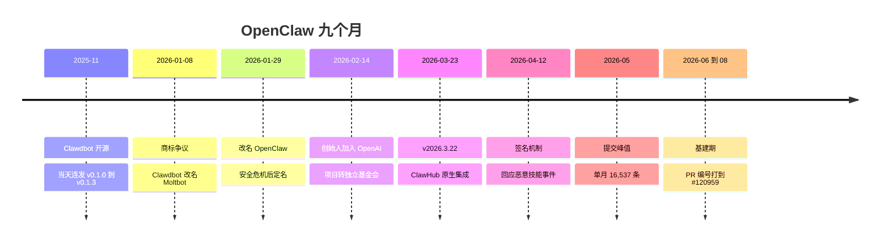
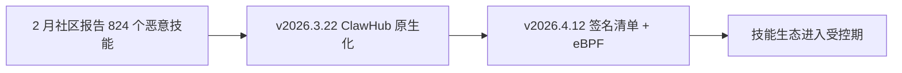

# 《OpenClaw 项目开发编年史,从爆火到易主的九个月》


> 整理日期 2026-08-09
> 数据来源 74,472 条主线提交聚合核对、344 个 tag、233 个 release、月度作者与版本统计、新闻与社区报道交叉验证
> 关联笔记 官方 release notes、ClawHub 技能市场、Moltbook 社区
> 核心结论 九个月从零冲到 GitHub 历史增长榜首,一个人贡献了一半提交,活跃作者从 2 人滚到 654 人再回落;一次商标争议把项目推向对手,版本号从 v0.1.0 一路滚到 v2026.6.34

## §0 项目是什么


OpenClaw 是一个开源的个人 AI 助手框架,跑在用户自己的设备上(最常见的形态是一台 Mac Mini),通过 WhatsApp、Telegram、Discord、Signal、iMessage 这些日常聊天应用跟人说话。它能清收件箱、管日历、订机票、执行代码、浏览网页、操控电脑。2025 年 11 月 24 日开源,九个月里成为 GitHub 历史上增长最快的开源项目,社区统计超过 150 万个 agent 被创建。它的吉祥物是龙虾,口号是 The claw is the law。

| 指标 | 数值 |
|---|---|
| 生命周期 | 2025-11-24 到 2026-08-08(约 9 个月) |
| 主线提交数 | 74,472(first-parent 口径) |
| 作者数 | 3,127 |
| tag 数 | 344 |
| release 数 | 233 |
| star 数 | 约 38.5 万 |
| 主要语言 | 以 Go 与 TS 生态为主,多语言并存 |

月度提交量(主线)。

```
2025-11 ████ 288
2025-12 ████████████████████████ 2087
2026-01 ██████████████████████████████████████████████████ 5263
2026-02 ████████████████████████████████████████████████████████████ 6854
2026-03 ████████████████████████████████████████████████████████████████████████ 8050
2026-04 ████████████████████████████████████████████████████████████████████████████████████████ 14586
2026-05 ████████████████████████████████████████████████████████████████████████████████████████████████ 16537
2026-06 ████████████████████████████████████████████ 7036
2026-07 ██████████████████████████████████████████████████████████ 11465
2026-08 ████████████ 2306(截至 8 月 8 日)
```

项目全景 timeline。



## §1 人物图鉴


| 作者 | 主线提交数 | 占比 | 角色定位 |
|---|---|---|---|
| Peter Steinberger | 37,895 | 50.9% | 创始人,整个项目的发动机 |
| Vincent Koc | 11,704 | 15.7% | 第二大贡献者,社区到核心的桥梁 |
| Shakker | 4,054 | 5.4% | 常驻贡献者 |
| Ayaan Zaidi | 1,842 | 2.5% | 核心圈贡献者,前后两个邮箱 |
| Tak Hoffman | 832 | 1.1% | 基础设施方向 |
| Gustavo Madeira Santana | 780 | 1.0% | 跨生态贡献者 |
| github-actions 等机器人 | 1,242 | 1.7% | 自动化与发布流水线 |

其余 3,100 余位作者合计约 22%。这个项目把"众包"写到了极致,但主线的一半始终握在一个人手里。月度活跃作者数本身就是一条故事线,11 月 2 人,12 月 11 人,1 月 304 人,2 月 654 人,随后在 500 到 600 之间震荡,8 月回落到 151 人。社区不是线性增长的,它在一个月内完成量级跃迁,又在热度退潮时自然收缩。

## §2 2025-11 诞生(288 条)


一句话。一个奥地利开发者用一小时搭出的 WhatsApp 助手原型,开源当天连发四个版本,名字叫 Clawd,谐音 Claude。

> 本月 288 条提交,2 位活跃作者,9 个 tag(v0.1.0 到 v1.2.2),发布节奏以天计

2025 年的 AI 助手都关在各自的 app 里,而聊天应用是所有人已经打开着的入口。Steinberger 把 Claude 接进 WhatsApp,让一个 AI 替他处理消息。原型管用,他决定开源。两个月后,谐音 Claude 的名字会引来 Anthropic 的法务,但在 11 月它只是一个小项目的俏皮话。

原型期最致命的问题在消息通道。WhatsApp 会话会卡死,看门狗超时不够用;AI 自己的回复会再次触发自己,回声循环。通道是唯一的入口,通道死了助手就死了,这个项目把身家押在一条通道上。

应对很朴素,三件套。会话自愈,看门狗超时调到 30 分钟;回声检测,给同手机模式加配置标记;边发布边打磨,11 月 25 日当天连发四个版本,用发布节奏倒逼可靠性。文档里已经写上了推特自动化和音乐识别示例,野心从诞生月就有。

事件批次。

**批次 01,消息通道的可靠性**。第一批提交里,WhatsApp 会话自愈和看门狗占据了显眼位置。

`Add auto-recovery from stuck WhatsApp sessions`、`Increase watchdog timeout to 30 minutes` WhatsApp 会话卡死自动恢复,看门狗超时调到 30 分钟。一个把身家押在消息通道上的助手,第一件事就是保证通道不死。

`feat: same-phone mode with echo detection and configurable marker` 同手机模式与回声检测。AI 和人在同一个 WhatsApp 账号里对话,自己的回复会再次触发自己,回声检测解决这个自我循环,这是消息 agent 独有的技术问题。

**批次 02,发布即高速迭代**。11 月 25 日当天,`chore: release 1.2.1`、`chore: release 1.2.2` 连着出现,版本号一天之内从 v0.1.0 滚到 v1.2.2。开源第一周就有 9 个 tag,没有"先打磨再发布"的过程,是边发布边打磨。

**批次 03,野心写在文档里**。`docs: Add Twitter automation and music recognition examples` 推特自动化和音乐识别示例进了文档;`Rename claude-config.md to clawd.md, update credits` 配置文档开始建立自己的名字。这个月的改动路径集中在 extensions/telegram、src/plugins 与 src/agents,插件架构在第一天就存在。

本章之变。项目从"能跑的脚本"变成"有版本、有文档、有插件架构的开源项目"。作者只有 2 人,但 9 个 tag 和 288 条提交证明它已经开始运转,WhatsApp 场景的可靠性问题在诞生月就基本解决。

本章关键词。`WhatsApp` `一小时原型` `当天四连发` `插件架构`

## §3 2025-12 产品化(2,087 条)


一句话。从"能跑的脚本"变成"有版本、有媒体处理、有名字的产品",活跃作者从 2 人跳到 11 人,仓库从 steipete/clawdis 迁向 openclaw。

> 本月 2,087 条提交,11 位活跃作者(2 到 11),5 个 tag(v1.0.4 到 v1.3.0)

开源三周,star 开始爬升,第一批陌生人的 PR 进来了。2 人团队,11 位作者,项目第一次要面对"别人的使用",被迫从原型转向产品,速度快得没有喘息,12 月 2 日,版本已经推到 v1.3.0。

2 人团队处理不了 10 倍的需求。图片语音被当裸数据收发,文档只有一份配置文件,版本号在 v1.2 到 v1.3 之间跳。每个缺口都是原型期不用管、产品期必须管的事。

三件套按优先级补。媒体按 MIME 嗅探处理,图片语音不再是裸数据;文档体系从 claude-config.md 改名建立,品牌走向自己的名字;版本节奏固定下来。仓库从 steipete/clawdis 迁向 openclaw,12 月的合并消息里还能看到前身仓库的地址,历史迁移的痕迹。

事件批次。

**批次 01,媒体处理**。`fix(media): sniff mime and keep extensions`、`docs: document mime-first media handling` 图片语音按 MIME 嗅探处理,不再把媒体当裸数据。聊天 agent 要收发图片和语音,媒体链路是产品化的第一块拼图。

**批次 02,仓库与品牌迁移**。`Merge branch 'main' of https://github.com/steipete/clawdis` 12 月的合并消息里还能看到前身仓库 steipete/clawdis 的地址,历史迁移的痕迹;`Rename claude-config.md to clawd.md` 系列提交把品牌从 Claude 谐音推向自己的名字。

**批次 03,渠道与自动化扩展**。Twitter 自动化、音乐识别从"文档里的例子"变成真实功能,消息渠道开始超出 WhatsApp 单点。

本章之变。项目从"单人项目"变成"小团队项目",11 位活跃作者里第一次出现了陌生名字。媒体链路、文档体系、版本节奏三件套就位,它开始像一个产品,而不再像一个脚本。社区从这章起成为变量。

本章关键词。`产品化` `媒体处理` `仓库迁移` `社区进场`

## §4 2026-01 改名风暴与版本制(5,263 条)


一句话。Clawdbot 被 Anthropic 商标争议点名,一周内改名三次,期间假代币骗局借势收割;版本号在同一个月切换成日期制,每天发布,活跃作者从 11 人跳到 304 人。

> 本月 5,263 条提交,304 位活跃作者(11 到 304),26 个 tag(v2.0.0-beta1 到 v2026.1.30)

一月是爆火后的失控期。作者数从 11 跳到 304,star 暴涨把 300 多位新作者带进仓库,项目第一次面对"社区规模超过管理能力"。1 月 27 日,Anthropic 法务提出商标争议,认为 Clawd 与 Claude 发音过近。一周之内,项目改了两次名,Clawdbot 改 Moltbot,再改 OpenClaw。改名窗口成了骗局的真空期,冒充项目的假 $CLAWD 代币骗局冲到 1,600 万美元市值,社区被收割了一轮。

工程上同样失控。300 人社区没有 CI 护栏,合入靠自觉;日更节奏没有版本纪律,tag 随心所欲。这个月 PR 编号从 #3677 打到 #5807,合入流水线其实已经成形,只是没人给它上锁。

应对是双线。品牌用改名切割,代价是失去 Claude 谐音带来的流量红利。工程补两道闸,conformance 一致性测试进 CI(PR 从 #3677 打到 #5807),版本制从语义化切到日期制,v2026.1.8 起每天一个 tag。改名风暴的余波,直接决定了 2 月创始人面对的选择。

事件批次。

**批次 01,工程护栏**。`Merge pull request #5723 from openclaw/ci/formal-conformance`、`#5807 ci/formal-conformance-alias-check` 形式一致性测试(conformance)进入 CI。1 月的 PR 编号从 #3677 打到 #5807,合入流水线在这个月定型,这是项目为 300 人社区准备的第一批护栏。

**批次 02,日期版本制**。`v2.0.0-beta1` 到 `beta5`(1 月 3 日)2.0 测试版在改名风暴前收尾;`v2026.1.8`(1 月 8 日)版本制切换,从此 tag 按日期走,v2026.1.11 当天连发四个补丁号。语义化版本在日更节奏下撑不住了,日期版本制是发布机器提速的必然结果。

**批次 03,改名与骗局**。1 月 27 日 Anthropic 法务提出商标争议,认为 Clawd 与 Claude 发音过近。1 月 8 日起 Clawdbot 改名 Moltbot,1 月 29 日定名 OpenClaw。改名窗口里,冒充项目的假 $CLAWD 代币骗局冲到 1,600 万美元市值,社区在品牌真空期被收割了一轮。

本章之变。作者数一个月从 11 跳到 304,项目第一次需要 CI 护栏和每日发布机器;品牌从 Clawd 变成 OpenClaw,名字与 Anthropic 彻底切割,但也因此失去了"Claude 谐音"带来的流量红利。改名风暴的余波,直接决定了 2 月创始人面对的选择。

本章关键词。`改名风暴` `日期版本制` `conformance` `假代币骗局`

## §5 2026-02 易主(6,854 条)


一句话。创始人接住 Meta 与 OpenAI 两边的橄榄枝,2 月 14 日宣布加入 OpenAI 领导下一代个人代理,项目转为 OpenAI 赞助的独立开源基金会;同月,824 个恶意技能的报告给技能生态蒙上阴影。

> 本月 6,854 条提交,654 位活跃作者(304 到 654,峰值),27 个 tag(v2026.2.x)

改名风暴把项目推到舆论中心,也把创始人推到了聚光灯下。扎克伯格亲自接触,Altman 称他"天才"。Steinberger 说"想改变世界,而不是开一家大公司",他面前摆着两条路,都是别人递过来的。

这个月暴露了两个绕不开的问题。50.9% 的主线提交握在创始人一个人手里,他离开项目就停。2 月 16 日前后,安全研究者统计出 ClawHub 上 824 个恶意技能,伪装成加密与效率工具窃取信息,供应链阴影第一次落到技能生态头上。

2 月 14 日,他宣布加入 OpenAI,项目转为 OpenAI 赞助的独立开源基金会。安全问题这个月只完成了报警,方案要等 4 月的签名机制,先让社区知道危险存在。

事件批次。

**批次 01,渠道矩阵**。`Merge remote-tracking branch 'prhead/feat/slack-text-streaming'` Slack 文本流式接入,渠道矩阵再扩一块。WhatsApp 起家的项目,这个月已经在铺企业协作的入口。

**批次 02,社区合入加速**。`#5807` 之后 PR 编号继续滚,社区贡献者的名字开始密集出现在合并消息里。654 位活跃作者是九个月的峰值,合入流水线在满负荷运转。

**批次 03,安全警报**。2 月 16 日前后,824 个恶意技能的统计公开。技能市场从第一天就有,但安全审查是后来才补的课,这个月只来得及发出警报,答案要等 4 月。

本章之变。创始人从独立开发者变成 OpenAI 的团队负责人,项目从个人项目变成基金会治理。作者数达到九个月峰值 654 人,但安全问题的种子也在本月种下。3 月的生态爆发,建立在 2 月这次治理转型之上。

本章关键词。`OpenAI` `基金会` `Slack` `恶意技能`

## §6 2026-03 生态爆发(8,050 条)


一句话。v2026.3.22 一次发布 45 个新功能、13 个破坏性变更,ClawHub 从网站变成 CLI 内建命令;同月 MoltHub 技能市场达到 8,000 多个技能的巅峰。

> 本月 8,050 条提交,660 位活跃作者,24 个 tag(v2026.3.x),技能数突破 8,000

基金会治理落地后的第一个完整月,团队与社区同时全速运转。技能生态在 2 月的恶意技能警报后没有减速,反而继续膨胀,MoltHub 达到 8,000 多个技能、20 万月活。

问题在入口。市场入口握在第三方手里,官方对"装什么技能"没有控制,野蛮生长没有刹车。官方需要把"装技能"这个动作抓回自己手里,3 月的版本就是答案。

v2026.3.22 一次发布 45 个新功能、13 个破坏性变更。ClawHub 原生接进 openclaw plugins install,技能市场从网站变成命令;48 小时默认 agent 超时,SSH 与 OpenShell 沙箱后端,执行环境开始受控;旧品牌痕迹(.moltbot 目录、CLAWDBOT_/MOLTBOT_ 环境变量)一次清完,改名风暴的尾巴在这个月扫尽。三月的合并消息几乎只剩主线对主线,分支策略收敛。

事件批次。

**批次 01,ClawHub 原生化**。`v2026.3.22`(3 月 23 日)45 个新功能,包括 48 小时默认 agent 超时、SSH 与 OpenShell 沙箱后端、一大批新 LLM 供应商,以及把 ClawHub 原生接进 `openclaw plugins install`。技能市场从"网站"变成"命令",生态入口收归官方。

**批次 02,旧品牌清场**。`移除 .moltbot 目录与 CLAWDBOT_/MOLTBOT_ 环境变量` 旧品牌痕迹一次性清掉,迁移交给 `openclaw doctor --fix`。改名风暴的尾巴在这个月扫完。

**批次 03,分支策略收敛**。`Merge branch 'main' of https://github.com/openclaw/openclaw` 三月的合并消息几乎只剩主线对主线,分支策略收敛,合入路径变短。

本章之变。技能生态从社区自发变成官方治理,ClawHub 原生化让"装技能"成为 CLI 的一等公民。8,000 技能的野蛮生长没有停,但管道的入口已经被官方接管。下一章的安全加固,就是在接管后的管道上动刀。

本章关键词。`v2026.3.22` `ClawHub` `沙箱` `破坏性变更`

## §7 2026-04 安全加固(14,586 条)


一句话。恶意技能事件后,4 月 12 日的版本给技能生态装上签名锁链,提交量冲到 14,586 的高位,发布节奏从日更进入周更加预发布。

> 本月 14,586 条提交,644 位活跃作者,62 个 tag(v2026.4.9 到 v2026.5.16-beta.7)

2 月的 824 个恶意技能警报需要一个代码层答案。技能是脚本,脚本能执行任意命令,市场越大,供应链风险越大,不能靠社区自觉。

v2026.4.12 的答案是三层锁。clawmanifest.json 用 SHA256 钉死文件路径、网络端点与 shell 命令,内核级 eBPF 强制杀掉脚本外的进程。供应链安全从"提醒"变成"强制","装技能"从信任社区变成信任签名。

安全加固没有拖慢开发。14,586 条提交是九个月第二高位,安全修复与功能迭代并行;发布节奏同步转型,从日更进入周更加预发布,v2026.4.9 到 v2026.5.16-beta.7,62 个 tag 是九个月的次高。

事件批次。

**批次 01,签名清单与 eBPF**。`v2026.4.12` 响应恶意技能,技能清单 clawmanifest.json 用 SHA256 钉死文件路径、网络端点与 shell 命令,内核级 eBPF 强制杀掉脚本外的进程。供应链安全从"提醒"变成"强制"。

**批次 02,版本节奏转型**。`v2026.4.9` 到 `v2026.5.16-beta.7`,4 月 9 日到 5 月 18 日的版本序列,beta 后缀开始出现,发布节奏从日更进入周更加预发布。62 个 tag 是九个月的次高,安全修复与功能迭代并行。

**批次 03,基建与安全的洪流**。`Merge branch 'main'` 海量合并提交是这一月的底色,14,586 条提交是九个月第二高位,基建与安全修复在峰值流量下并行推进。

本章之变。技能生态第一次有了强制安全边界,签名清单加 eBPF 的三层机制让"装技能"从信任社区变成信任签名。14,586 条的提交量说明安全加固没有拖慢开发,反而与功能开发并行冲到次高。5 月的巅峰,就在这个基础上到来。

本章关键词。`签名机制` `eBPF` `供应链安全` `14,586`

## §8 2026-05 巅峰(16,537 条)


一句话。单月 16,537 条主线提交、86 个 tag,九个月的最高点;同月,"百代理并行、每月烧 130 万美元"的报道让"龙虾之父烧钱"成为科技媒体标题。

> 本月 16,537 条提交(峰值),564 位活跃作者,86 个 tag(峰值),PR 编号进入 #8xxxx 段

安全加固没有减速开发,5 月的提交量冲到九个月最高。16,537 条主线提交、86 个 tag,双双创下纪录,PR 编号进入 #8xxxx 段,社区 PR 池已经深到五位数。

问题在天花板。人力是有限的,功能需求还在涨,传统的"人写代码"模式见顶。这个月公开的答案让所有人愣住,Steinberger 带进 OpenAI 的团队用约 100 个并发 AI 编码代理开发 OpenClaw,每月烧掉约 130 万美元的 API 额度。"龙虾之父烧钱"成了科技媒体标题,但它确实撑住了峰值。

同期 Moltbook 上线,纯 AI agent 组成的社交网络开始运转,dancesWithClaws 的 "Logan" 每小时心跳发帖,扫描 feed、发 Cardano 内容、查 DM、更新记忆,一个 agent 活成了自媒体。

事件批次。

**批次 01,提交洪峰**。16,537 条主线提交、86 个 tag,双双创下九个月纪录。`#8xxxx` 段 PR 编号出现,社区 PR 池已经深到五位数。

**批次 02,百代理开发模式公开**。同月报道,Steinberger 团队约 100 个并发 AI 编码代理、每月 130 万美元 API 消耗的细节公开,"龙虾之父烧钱"成了科技媒体的标题。AI 代理开发 AI 代理,OpenClaw 自己就是自己工作流的最佳案例。

**批次 03,AI 社交网络**。Moltbook 上,纯 AI agent 组成的社交网络(moltys)已经跑起来,dancesWithClaws 的 "Logan" 每小时心跳发帖,扫描 feed、发 Cardano 内容、查 DM、更新记忆。

本章之变。九个月的峰值定格在 5 月,提交、版本、媒体报道三线全高。但这个月也是拐点的起点,作者数从 4 月的 644 回落到 564,6 月的提交量直接腰斩。巅峰之后,项目进入基建期。

本章关键词。`16,537` `百代理并行` `Moltbook` `烧钱`

## §9 2026-06 到 08 基建期(20,807 条)


一句话。三个月合计 20,807 条提交,PR 编号从 #87xxx 滚到 #120959,焦点从功能扩张转向基础设施,活跃作者从 417 人回落到 151 人。

> 6 月 7,036 条、417 位作者、61 个 tag;7 月 11,465 条、524 位作者、32 个 tag;8 月 2,306 条(截至 8 日)、151 位作者、12 个 tag

九个月的功能爆炸留下一批"先能用、后修好"的债,焦点从扩张转向加固。7 月 PR 编号突然跳到 #87xxx 和 #116xxx,编号池的跳跃说明合入管线经历过大迁移,基建工作与管线重构交织在一起。

三个系统性问题集中暴露,通话链路不稳定(OpenAI 实时语音认证、中继断连、Discord 语音保留),本地推理没人管(llama.cpp 生命周期),启动并发互相打架(迁移 lease)。都是峰值流量下欠下的工程债。

逐项还债。7 月,社区成员 BSG2000 直接修核心通道(PR #87273),通话中继断连清理(#116684);8 月,Discord 实时语音保留上限、llama.cpp 生命周期修复、启动迁移 lease 并发修复(#120959,最新的主线提交)。版本节奏没有停,v2026.6.34 滚到九个月第 233 个 release。

事件批次。

**批次 01,实时语音链路**。`Merge pull request #87273 from BSG2000/fix/talk-openai-realtime-auth-diagnostic-pr` 7 月,OpenAI 实时语音的认证诊断,社区成员直接修核心通道;`Merge pull request #116684 from openclaw/fix/talk-relay-disconnect-cleanup` 通话中继断连清理;`merge: bound Discord realtime exact speech retention` 8 月,Discord 实时语音保留上限。通话从"能通"走向"稳定"。

**批次 02,本地推理**。`merge: land llama.cpp lifecycle fix` 本地推理引擎生命周期修复。本地优先的路线还在,llama.cpp 的生命周期管理是"先能用、后修好"的又一例。

**批次 03,启动并发与扩展**。`#120959`(8 月 8 日)fix(infra): 启动迁移 lease 并发修复,最新的主线提交;`merge: align Fish Audio extension directory` 扩展目录对齐。`v2026.6.34`(8 月 4 日)版本号滚到 6.34,九个月发布了 233 个 release。

本章之变。项目从"扩张"转入"加固",实时语音、本地推理、启动并发逐项还债,版本号滚到 v2026.6.34。活跃作者从峰值 654 回落到 151,社区热度退潮,但提交仍在高位,核心团队与基金会撑住了节奏。九个月的故事在这里定格,而不是结束。

本章关键词。`基建期` `#120959` `实时语音` `llama.cpp`

## §10 尾声(经验总结)


1. **一个人是发动机,社区是燃料**。50.9% 的主线提交来自创始人,但没有 3,100 多位贡献者,九个月到不了这个量级。月度作者数 2 到 654 再回 151 的曲线,就是社区生命周期的缩影。
2. **品牌是命门**。Clawd 谐音 Claude 的取名在九个月后回头看,是爆火的起点,也是被商标争议点名、被迫一周三改的伏笔。
3. **生态要趁早锁死**。ClawHub 原生集成、签名清单、eBPF 强制的三层,是技能市场从 8,000 个技能野蛮生长后必须补的课;824 个恶意技能是这门课的学费。
4. **烧钱换速度是阶段选择**。100 个并发代理、每月 130 万美元,不是每个项目都该学,但 OpenClaw 用它在九个月里烧出了 GitHub 历史增长纪录。
5. **版本号跟着时代走**。v0.1.0 到 v2026.6.34,从语义化到日期制,版本号本身就是一部编年史。

## §11 社区回声


与 git 主线并行的是一条密度极高的社区史,媒体、市场、骗局与社交网络纠缠在一起。

- **龙虾文化**。吉祥物龙虾与 The claw is the law 成为项目的文化符号,社区自称 "lobster"。
- **Moltbook**。一个只有 AI agent 能发帖的社交网络,agent 们(moltys)在上面发帖、点赞、互相评论,OpenClaw 技能让 agent 每小时心跳报到。
- **技能市场**。MoltHub 巅峰 8,000 技能、20 万月活,官方 ClawHub 接手后 3,000 多个技能,还能自动映射 Claude、Codex、Cursor 的技能包。
- **供应链阴影**。824 个恶意技能、假 $CLAWD 代币,社区史里的暗面,两次都被代码层回应(签名机制、改名)。
- **创始人之争**。Meta 的扎克伯格亲自挖人,OpenAI 的 Altman 称他"天才",Anthropic 被媒体称为"最大的失误"。
- **社区规模曲线**。活跃作者从 11 月的 2 人,到 2 月峰值的 654 人,再到 8 月的 151 人。九个月走完了别的开源项目十年的社区周期。

### 互文时刻

拿安全事件画成流程图,社区报告与代码落地隔空相望。



社区先出题,代码后交卷,是这九个月最清晰的互文。改名风暴是另一个方向,代码先改名(1 月 8 日起),社区与市场随后反应(骗局、舆论),品牌事件里代码走在前面。

## 附录 A 版本与改名时间线


- `v0.1.0` 到 `v0.1.3`,2025-11-25,开源当天连发
- `v1.3.0`,2025-12-02,产品化
- `v2.0.0-beta1` 到 `beta5`,2026-01-03,改名风暴前夜
- `v2026.1.8`,2026-01-08,日期版本制开启
- Clawdbot 到 Moltbot,2026-01-08 到 01-10,Anthropic 商标争议
- Moltbot 到 OpenClaw,2026-01-29,安全危机后定名
- 创始人加入 OpenAI,2026-02-14,项目转基金会
- `v2026.3.22`,2026-03-23,ClawHub 原生集成
- `v2026.4.12`,安全签名机制
- `v2026.6.34`,2026-08-04,最新 release
- 月度版本数,11 月 9 个、12 月 5 个、1 月 26 个、2 月 27 个、3 月 24 个、4 月 62 个、5 月 86 个、6 月 61 个、7 月 32 个、8 月 12 个
- ★ 标记重大事件。tag 为 344 个,此处列关键节点。

## 文末注 数据方法论


- 主线口径。提交数取 first-parent 主线 74,472 条,不含分支噪音;总提交 77,372 条。
- 大仓库策略。提交数远超 5000 阈值,采用月度聚合加里程碑窗口精读,正文只列代表性提交;统计数字来自 per_year.tsv、per_author.tsv 与月度聚合。
- 月度作者数。按 author email 在当月主线提交中去重统计,机器人账号(github-actions、clawsweeper)计入当月作者数。
- 版本与事件交叉验证。tag、release 与新闻时间线(改名、加入 OpenAI、恶意技能)互相核对,新闻来源见正文链接。
- PR 编号。提交消息中的 #N 从 #3677 滚到 #120959,编号池跨越项目迁移,不能直接当 PR 总数用。
- 社区数据。star 数、agent 数、技能数与月活来自公开报道与 ClawHub 页面,帖子级明细未逐帖抓取。
- 插图由生图 API 生成,章节插图用 doubao-seedream-5-0-260128,1920x1920;封面用 wan2.7-image,1024x1365。风格统一为手绘编年史风。

---

本文由 [git-repo-chronicle](https://github.com/tsonglew/git-repo-chronicle) 生成
