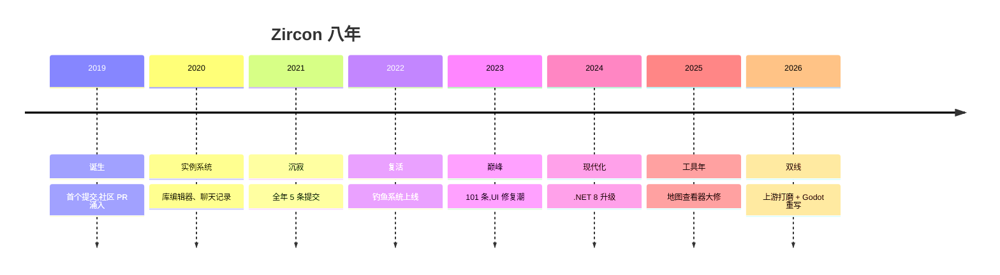

# 《Zircon 项目开发编年史,从 0 到 1 的八年》


> 整理日期 2026-08-07
> 数据来源 499 条 git 提交逐一核对、LOMCN 论坛板块统计、源仓库 PR 编号 #2 到 #261 共 123 个
> 关联笔记 仓库内 docs/notes 笔记 07、08、09 系列
> 核心结论 一个人撑起八成提交,社区 PR 从第一年就不断涌入;2026 年 8 月 6 日的一次 fork,把八年历史接上了 Godot 重写的新叙事

## §0 项目是什么

Zircon 是传奇 3(Legend of Mir 3)的服务器与客户端模拟器,用 C# 写成,2019 年 2 月由 Suprcode 团队在 GitHub 公开,是 LOMCN 社区官方认可的开放源码项目。八年里它以每周数条到每月几十条的节奏迭代,没有发过一次正式 release,版本就是 master 分支本身。

| 指标 | 数值 |
|---|---|
| 生命周期 | 2019-02 到 2026-08(约 8 年) |
| 提交总数 | 499 |
| 作者数 | 22 |
| 含 # 编号的提交 | 120 |
| release 数 | 0(版本即 master) |
| 主要技术栈 | C# / .NET Framework → .NET 8 → .NET 10 |
| 源仓库 | Suprcode/Zircon(fork 于 2026-08-06) |

```
2019 ██████████ 55
2020 ████ 21
2021 █ 5
2022 █████████ 46
2023 ████████████████████ 101
2024 █████████████ 68
2025 ████████████████ 80
2026 ████████████████████████ 123
```

项目全景 timeline。



## §1 人物图鉴

| 作者 | 提交数 | 活跃期 | 角色定位 |
|---|---|---|---|
| AndyF / Suprcode | 397 | 2019 到 2026 | 核心开发者,同一邮箱 development@suprcode.com,占全部提交 79.5% |
| CHEYAN | 26 | 2026 | fork 主,Godot 客户端重写与笔记作者 |
| Bernat Vadell | 16 | 2019 到 2020 | 早期贡献者(hounter.caza@gmail.com) |
| Ryan Taplin | 14 | 2019 到 2023 | 常驻贡献者,PR 从 #19 开始 |
| Lilcooldoode | 9 | 2023 到 2026 | 玩法与修复 |
| LionsMight1 | 8 | 2019 到 2021 | 早期贡献者 |
| Carl Brand | 6 | 2025 到 2026 | 地图工具与数据库 |

其余 15 位作者合计 23 条,多为单次或几次的过路贡献,其中包括依赖机器人 dependabot。

## §2 2019 诞生

一句话。公开当天就有社区 PR 进来,这个项目从第一行代码起就不是一个人的。

`1647f9e` Initial Commit(AndyF),首个提交,带来可视化随身装备,一个能跑的传奇 3 服务端雏形。

`#23` account packet spamming fix(Pete107 等),账号包防刷,社区 PR 第一波就开始修协议层。

`#22` Support for ILIB v2.0 WEMADE(Suprcode),支持韩方 ILIB 图库 v2.0,客户端资源从此跟上原版。

`#19`、`#20`、`#21` RyanTaplin1705、LionsMight1、Pete107 的合并,三个社区贡献者同一年入场,排名、经验、界面修复各一。

`352f818`(大致同期)Base Stats Viewer,基础属性查看器,工具链开始成形。

本章关键词。`社区 PR` `ILIB` `可视化装备` `工具链起步`

## §3 2020 架构年

一句话。实例系统(Instance System)落地,服务端从单场景走向可复制的副本空间。

`#41` Chatlog view,聊天记录视图,客户端 UI 补一块。

`#43` library editor changes,库编辑器,配套工具继续长。

`#44` fix rankingdialog labels,排行对话框标签修复。

`#46` Drop highlight + companion filter,掉落高亮与伙伴过滤,玩法细节。

`Instance Feature`、`Basic Instance System`(Suprcode),实例系统从 feature 到 basic 落地,八年后的副本功能都长在这上面。

本章关键词。`实例系统` `库编辑器` `玩法细节`

## §4 2021 沉寂

一句话。全年五条提交,项目差一点在这里停住,但埋下了两个伏笔。

`Basic plugin loader`(Suprcode),基础插件加载器,2025 年插件能力的种子。

`Basic particle system for spells`,法术粒子系统,默认关闭。

`#47`、`#48` coding mistake fixing、依赖升级,两条小修,一条 dependabot 的依赖更新。

`Instance dungeon finder bug fix`,副本查找器 bug 修复。

本章关键词。`沉寂` `插件伏笔` `粒子系统`

## §5 2022 复活

一句话。钓鱼系统上线,提交数从 5 回到 46,项目活了过来。

`Fishing System`(Suprcode),钓鱼系统,一条完整的玩法闭环,复活年的标志性提交。

`Moved currency loading to account info` 及其回退,货币加载挪到账户信息,提交后回退,再提交,典型的改错了再改回来。

`Reset discipline after Rebirth`,转生后重置纪律点数,成长体系补全。

`Fix npc visibility bug`,NPC 可见性修复。

本章关键词。`钓鱼` `复活` `成长体系`

## §6 2023 巅峰

一句话。101 条提交,社区 PR 编号从 #110 一路打到 #117,UI 修复潮把客户端磨圆了。

`#110`、`#111` Bugfixes1,两批社区修复,作者署名来自 LOMCN 常客。

`#112` Updated character dialog label colour,角色对话框颜色。

`#114` fix for teleport ring on bigmap / gm move,传送戒指与大图传送修复。

`#115` Added RespawnIndex to Instances/Respawns(CheekyVimto),实例刷怪索引,社区直接改数据结构。

`#116` Hide item links on chat fade,聊天淡出时隐藏物品链接。

`#117` Small default chat colour changes,聊天默认颜色微调。

`spell autolock fix`,法术自动锁定修复,战斗手感的一环。

本章关键词。`UI 修复潮` `社区 PR` `#110-#117` `手感打磨`

## §7 2024 现代化

一句话。.NET 8 升级让项目离开 .NET Framework 时代,城堡玩法同日修复。

`#162` .NET8 and Package Updates(Suprcode),.NET 8 与依赖包升级,2025 年的 .NET 10 和 Linux 部署都从这里起步。

`#161` Fix flag and lord spawning bug,沙巴克旗与城主刷新修复,城堡战核心逻辑。

`Fixed Castle npcs not respawning after war end`,战后城堡 NPC 不刷新的修复。

`Map Viewer fixes`,地图查看器开修,为 2025 的工具年铺路。

`sell all fix when any item allowed`,全部出售按钮的边界修复。

本章关键词。`.NET 8` `城堡战` `地图查看器前奏`

## §8 2025 工具年

一句话。地图查看器大修一年,用户缓存与插件能力同时落地,项目从"能玩"走向"好用"。

`Map Viewer` 系列(Suprcode、Carl Brand),地图查看器滚动、鼠标位置、选中格计数、地图尺寸,前后十余条提交。

`#210` fix link item crash,物品链接崩溃修复。

`#211` Big Map icon bug fix,大图图标修复。

`#215` Fixed ALT key bug,ALT 键冲突修复。

`Added User Cache to store server user preferences`,用户偏好缓存,主题、展开菜单、窗口最大化都记住了。

`Version encryption updated`、`Cached cell library lookup`,版本加密与图库缓存,性能与安全各一条。

本章关键词。`地图查看器` `用户缓存` `插件能力` `#210-#215`

## §9 2026 双线

一句话。上游继续打磨到 #261,同一天,一次 fork 把 Godot 重写推上快车道,两条线在同一仓库里并行。

### 上游线(Suprcode,96 条)

`#255` consignment fix,寄售修复。

`#256` Socket Balance Fixes,装备孔位平衡。

`#257` TextBox cache bug fix,输入框缓存修复。

`#258` Horse Taming,驯马系统,又一个玩法系统。

`#261` auto pathing and waypoints,自动寻路与路径点。

`dungeon spawn multiplier`、`DungeonInfo`、`AverageMonsterExperience`,副本数值体系补全。

### 重写线(CHEYAN,26 条)


`3b5889c5` Godot 客户端骨架,登录与选角色全流程走通,第 2 步完成,Godot 重写从设计图变成可跑的东西。

`04405486` 地图渲染,.Zl 图库与 .map 地图读取器,旧资源格式在新引擎里复活。

`cda56737` 笔记 09 增补,LOMCN 论坛社区纪事,重写者一边写代码一边修编年史,项目历史与新叙事在同一批提交里。

`M1` 到 `M12`,从 StartGame 回包处理到 HUD 与键位,十二个里程碑在两天内密集合入,重写线进入高速迭代。

本章关键词。`驯马` `自动寻路` `Godot 重写` `M1-M12`

## §10 尾声(经验总结)

1. **一个人撑起项目**。AndyF 与 Suprcode 同属一人,79.5% 的提交来自他,2021 年他停手,项目立刻沉寂;他回来,项目就复活。
2. **社区是水,也是堤**。PR 从 #19 打到 #261,社区贡献者修界面、加玩法、改数据结构;但没有 maintainer 合入,一切都是零,2021 年就是证据。
3. **架构复利**。2020 年的实例系统、2021 年的插件加载器,分别在三四年后变成副本玩法与插件能力的底座。
4. **技术栈跟随时代**。.NET Framework 到 .NET 8 再到 .NET 10,每一次升级都在为"能在 Linux 上跑服务端"铺路。
5. **一次 fork 开启新叙事**。2026 年 8 月 6 日的 fork 没有分叉历史,而是把八年积累变成 Godot 重写的资源,编年史也从此有了双线。

## §11 论坛回声


与 git 主线并行的,是 LOMCN 论坛的社区史。板块名就叫"Zircon Mir3 Files (Open Source)",约 1,100 个主题、5,400 条消息,开发者署名 Jamie 与 Far(与 git 作者 AndyF/Suprcode 的关系未直接证实)。

- **发布之夜**。2019 年开源消息在 LOMCN 铺开,私服圈第一次有了官方开放的传奇 3 源码。
- **服务端生态**。社区用 Zircon 搭服务器,2025 年 11 月"Mir 3 Revival"低倍率服开服,等级上限 80,700 余件新物品,自定义地图与 BOSS。
- **中文社区**。第三方项目"皓石传奇三"把 2019 年版本 Docker 化并做中文客户端,面向 Linux 部署;gitee 上也有镜像仓库,中国玩家从 2019 年的翻译诉求一路走到 2024 年的中文化项目。
- **工具接力**。LOMCN 2025 年发布的新工具重建了数据库结构,旧版 2019 存档因此不兼容,社区数据随代码一起换代。

### 互文时刻

拿 2023 年的 UI 修复潮画成流程图,论坛呼声与代码落地隔空相望。


论坛先喊、代码后到,是 Zircon 八年最常见的节奏;2021 年论坛喊得最凶的时候,代码却沉睡了整整一年。

## 附录 A PR 时间线(按年,节选)

- `#19`、`#20`、`#21`、`#22`、`#23`(2019,★ 社区入场)
- `#41`、`#43`、`#44`、`#46`(2020,★ 实例系统与工具链)
- `#47`、`#48`(2021,沉寂期)
- `#110` 到 `#117`(2023,★ UI 修复潮)
- `#161`、`#162`(2024,★ .NET 8 升级)
- `#210`、`#211`、`#215`(2025,工具年)
- `#255` 到 `#261`(2026,★ 驯马与寻路)
- ★ 标记重大事件。编号不连续处为无编号直接提交。

## 文末注 数据方法论

- git log 含 merge 提交,共 499 条;年份以合入日期为准。
- PR 编号从提交消息提取 `#N`,120 条提交带编号,与源仓库 PR 体系 #2 到 #261 对齐;无编号的为直接提交。
- 本仓库为 fork,2026-08-06 自 Suprcode/Zircon fork;2026 年数据同时包含上游提交(96 条)与 fork 提交(26 条)。
- 论坛数据来自 LOMCN 公开板块统计与检索结果,帖子级明细未逐帖抓取,覆盖率低于笔记 09 附录 C。
- 插图由生图 API 生成,具体如下。用户提供的 gemini-3.1-flash-lite-image 模型在平台上不支持文生图(仅 imagen 类可用),实际改用平台可用的 wan2.7-image,风格统一为手绘编年史风。提示词与生成参数见 illustrations.md 规范。
