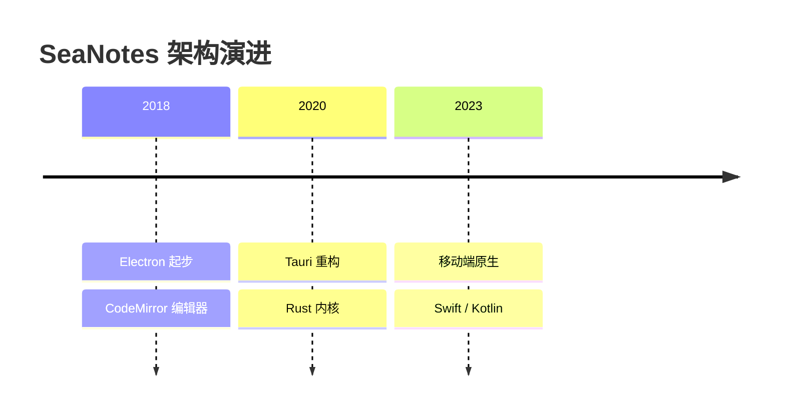
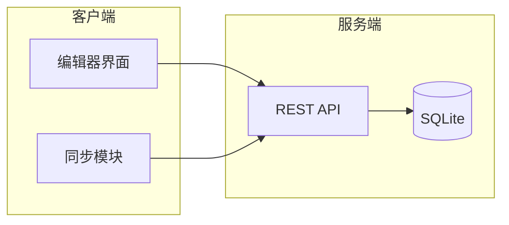
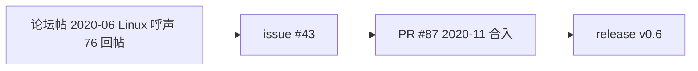
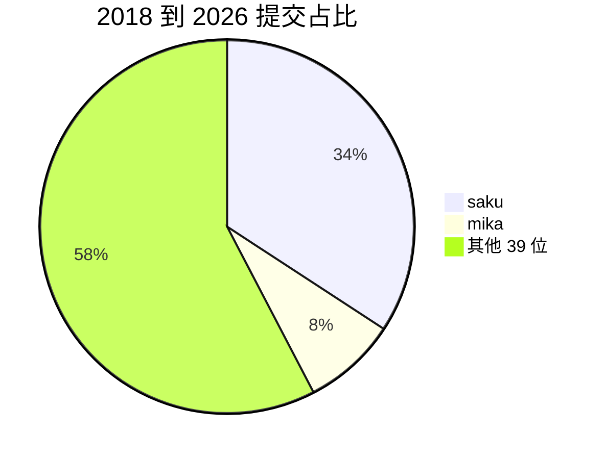

> 配图规范。默认 Mermaid 嵌入 Markdown,GitHub 原生渲染;图类型与位置、写法示例、独立图片导出与校验。图从数据来,不先画图再凑数据。

# 编年史配图手册

编年史正文按年叙事,配图把"演进"本身画出来。本文定义配什么图、画在哪里、用什么语法。

## 配图原则

1. 图从数据来。图上每个数字、节点、箭头,都能在正文或数据源里找到出处。先有数据和叙事,再决定画什么,不许先画图再凑数据。
2. 图服务于叙事。全篇五到八张,每章最多一到两张。同一信息只画一次。
3. 默认 Mermaid,直接嵌进 Markdown 代码块,GitHub 打开即渲染,零依赖。需要独立图片文件时,用 mermaid-cli 或 Graphviz 导出。

## 图类型与位置

| 图 | 画什么 | 放哪 |
|---|---|---|
| timeline | 生命周期关键节点、架构演进 | §0 项目全景,架构转型章节开头 |
| flowchart | 系统架构、模块关系、互文流程 | 里程碑年份的架构快照,§11 互文时刻 |
| pie | 作者贡献占比、语言占比 | §1 人物图鉴(可选) |
| xychart / ASCII | 年度提交量、论坛热度对照 | §0 全景数字,§11 热度对照 |
| sequenceDiagram | 发布流程、协作时序 | 少用,仅当流程本身是叙事重点 |

具体位置。

- §0 项目是什么。放一张 timeline,把生命周期关键节点连起来(诞生、架构转型、发布、停更、复活)。
- 架构转型年份。放迁移前后对比,画两张 flowchart 或一张"前到后"的图,节点用当时的真实组件名。
- 里程碑年份。放当前架构快照,服务端、客户端、数据层各自成块,块上注明 commit 哈希。
- §11 论坛回声。互文时刻画成 flowchart,从论坛帖一路连到落地提交。

## Mermaid 写法示例

### timeline(架构演进)



### flowchart(架构快照)



### flowchart(互文时刻)



### pie(作者贡献)



## 语法注意

- 节点文字别用括号、引号、分号等特殊字符,要用就给文字加引号。
- flowchart 方向。LR 适合演进流程,TD 适合层级架构。
- subgraph 给组件分组,避免图太散。
- 数字必须与 `per_year.tsv`、`per_author.tsv` 或正文一致。
- GitHub 对 Mermaid 的支持够用,复杂图先本地验证再交。

## 导出独立图片

需要 PNG/SVG 文件时,用下面的命令。

```bash
# mermaid-cli(需 Node)
npx -y @mermaid-js/mermaid-cli -i arch.mmd -o arch.png

# Graphviz
dot -Tsvg arch.dot -o arch.svg
```

图片放进 `docs/notes/images/`,正文用相对路径引用。图里的中文要确认渲染字体支持。

## 校验

1. 每张图对照正文数据,数字一致。
2. 每条连线问一句,这个关系在正文哪句话里。答不上来就删边。
3. 图的叙事贡献。删掉这张图,正文少了什么。没有就删图。
4. Mermaid 语法正确,能在 GitHub 渲染。
